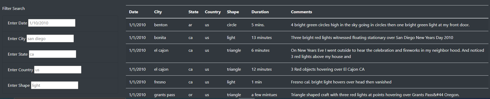

# UFOs

## Overview of the analysis:

The purpose of this analysis is to use UFO's data, stored as a JavaScript array, to create a table that permits filtering all its information contained according to selected criteria. 

## Results:

To performing a custom search in the page the person must look at the Filter Search Box at the left side of the page, where it can enter the needed criteria to execute the search according to its preference.

## Summary:

An inconvenient the page has is that the search box will not work unless the entered criteria matches the data in the exact way as its written. For example: CA will not be recognized unless is written ca. Therefore, a possible solution to this will be to included all the spelling variables the data may have. 
